# Wiki Documentation for <https://github.com/zazu-22/band_assist>

Generated on: 2025-11-20 17:17:26

## Table of Contents

- [Project Overview & Setup](#page-1)
- [Application Architecture](#page-2)
- [State Management & Data Persistence](#page-3)
- [AI Integration (Gemini Service)](#page-4)
- [Core Data Models](#page-5)
- [Key Components: SongDetail & SmartTabEditor](#page-6)

<a id='page-1'></a>

## Project Overview & Setup

### Related Pages

Related topics: [Application Architecture](#page-2)

<details>
<summary>Relevant source files</summary>
The following files were used as context for generating this wiki page:

- [`App.tsx`](https://github.com/zazu-22/band_assist/blob/main/App.tsx)
- [`index.html`](https://github.com/zazu-22/band_assist/blob/main/index.html)
- [`types.ts`](https://github.com/zazu-22/band_assist/blob/main/types.ts)
- [`components/Navigation.tsx`](https://github.com/zazu-22/band_assist/blob/main/components/Navigation.tsx)
- [`components/Settings.tsx`](https://github.com/zazu-22/band_assist/blob/main/components/Settings.tsx)
- [`services/geminiService.ts`](https://github.com/zazu-22/band_assist/blob/main/services/geminiService.ts)
- [`components/AlphaTabRenderer.tsx`](https://github.com/zazu-22/band_assist/blob/main/components/AlphaTabRenderer.tsx)

</details>

# Project Overview & Setup

The Band Assist project, titled "Sharp Dressed Band," is a single-page web application designed to help bands manage their songs, schedules, assignments, and practice materials. It is built using React and runs entirely in the browser, leveraging local storage for data persistence. The application provides a comprehensive suite of tools, including a dashboard, setlist builder, practice room, and detailed song management capabilities.

The architecture is centered around a main `App` component that manages application state and controls which view is rendered. It integrates external libraries for specific functionalities, such as `@google/genai` for AI-powered music analysis and `AlphaTab` for rendering Guitar Pro files. The UI is styled with Tailwind CSS, providing a modern, dark-themed interface.

Sources: [`App.tsx`](), [`index.html`](), [`components/Navigation.tsx`]()

## Core Architecture

The application follows a component-based architecture typical of a React SPA. A single HTML file, `index.html`, serves as the entry point, which loads the necessary scripts and mounts the root React component.

Sources: [`index.html:1-33`]()

### Component Structure

The main `App` component acts as the central controller. It holds the primary application state (songs, members, events) and manages the current view. Based on the `currentView` state, it conditionally renders one of the main page components like `Dashboard`, `SongDetail`, or `Settings`.

The diagram below illustrates the high-level component hierarchy.

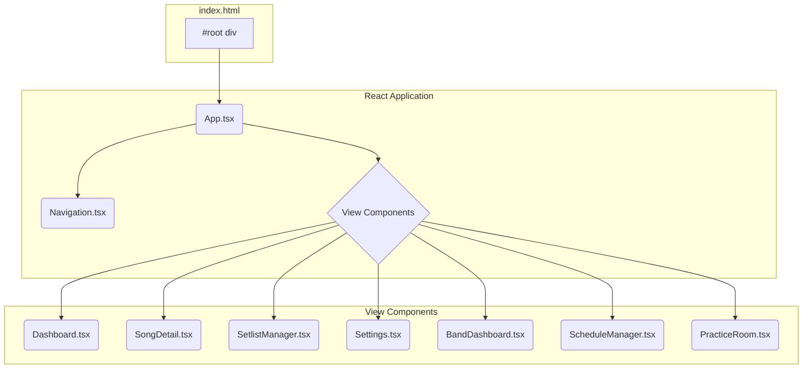

*A diagram showing the main component structure.*

Sources: [`App.tsx:15-108`](), [`index.html:30`]()

### External Dependencies

The project relies on several key external libraries loaded via CDN in `index.html`.

| Library                 | Purpose                                                                |
| ----------------------- | ---------------------------------------------------------------------- |
| `react` / `react-dom`   | Core library for building the user interface.                          |
| `tailwindcss`           | A utility-first CSS framework for styling.                             |
| `@google/genai`         | Client library for interacting with Google's Gemini AI models.         |
| `lucide-react`          | A library of SVG icons.                                                |
| `@coderline/alphatab`   | A music notation and guitar tablature rendering library.               |

Sources: [`index.html:6-27`]()

## Data Model

The application's data is structured around several core types defined in `types.ts`. The primary entities are `Song`, `BandMember`, `SongChart`, and `BandEvent`.

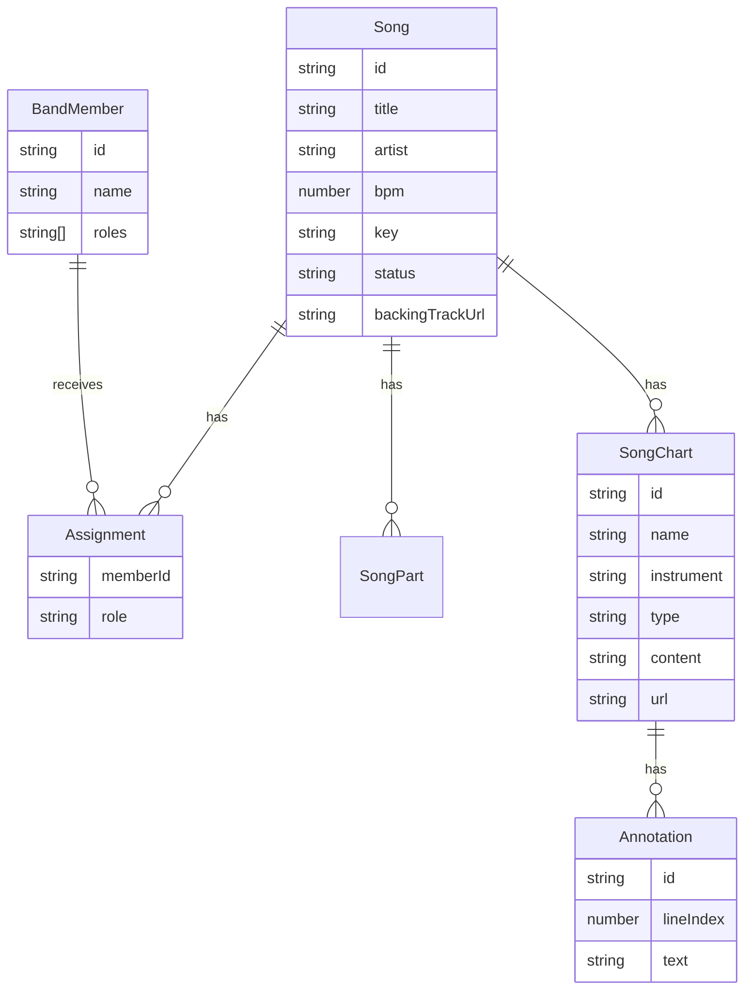

*An Entity-Relationship diagram of the core data models.*

Sources: [`types.ts:1-100`]()

Key data structures include:

- **`Song`**: Represents a single song with metadata (title, artist, key, bpm) and associated data like assignments, parts, and charts.
- **`SongChart`**: A flexible structure for storing musical information. It can be of type `TEXT`, `IMAGE`, `PDF`, or `GP` (Guitar Pro), with content stored either as a string or a Base64 data URI.
- **`BandMember`**: Represents a member of the band, with a name and a list of their preferred roles.
- **`Assignment`**: Links a `BandMember` to a specific `role` for a given `Song`.
- **`Annotation`**: A note attached to a specific line within a `TEXT` type `SongChart`.

Sources: [`types.ts:1-100`]()

## State Management and Persistence

The application manages its state within the main `App` component using React's `useState` hook. There is no external state management library like Redux.

Sources: [`App.tsx:15-56`]()

### Initialization and Persistence

On application load, the state is lazily initialized. The `useState` initializer function attempts to load data from the browser's local storage using a `StorageService`. If no data is found in storage, it falls back to initial default data.

The `StorageService` is responsible for abstracting the `localStorage` API, providing `load` and `save` methods. Data is saved whenever state-setting functions (e.g., `setSongs`, `setMembers`) are called, ensuring that any changes are persisted.

```mermaid
sequenceDiagram
    participant User
    participant App as App Component
    participant Storage as StorageService
    participant LS as Browser LocalStorage

    User->>App: Loads Application
    activate App
    App->>+Storage: load()
    Storage->>+LS: getItem('band-assist-data')
    LS-->>-Storage: Returns stored JSON string (or null)
    alt Data Exists
        Storage-->>-App: Returns parsed data object
    else No Data
        Storage-->>-App: Returns empty object
        App->>App: Uses INITIAL_SONGS / default members
    end
    App->>App: Initializes state with data
    deactivate App

    User->>App: Makes a change (e.g., edits a song)
    activate App
    App->>App: Calls setSongs(updatedSongs)
    note over App: useEffect hook triggers on state change
    App->>+Storage: save({ songs: updatedSongs, ... })
    Storage->>+LS: setItem('band-assist-data', jsonString)
    LS-->>-Storage: Confirms save
    Storage-->>-App:
    deactivate Storage
    deactivate App
```

*A sequence diagram showing the data loading and saving flow.*

Sources: [`App.tsx:18-21`](), [`components/Settings.tsx:10`](), [`App.tsx:58-62`]()

## View Navigation

Navigation is handled by the `App` component, which maintains a `currentView` state variable of type `ViewState`. The `Navigation` component displays a list of clickable items, and clicking one calls the `onNavigate` handler, which updates the `currentView` in the `App` component. This state change causes `App` to re-render and display the corresponding view component.

```mermaid
graph TD
    A[User clicks nav item in Navigation.tsx] --> B{onNavigate(view) called};
    B --> C[App.tsx receives new view];
    C --> D[setCurrentView(newView)];
    D --> E{App component re-renders};
    E --> F[Conditional rendering logic shows correct component];

    subgraph "App.tsx Render Logic"
        F --> G1{currentView === 'DASHBOARD' ?};
        F --> G2{currentView === 'SONG_DETAIL' ?};
        F --> G3{... and so on};
    end

    G1 -- Yes --> H1[<Dashboard />];
    G2 -- Yes --> H2[<SongDetail />];
```

*A flowchart illustrating the view navigation logic.*

Sources: [`App.tsx:15, 64-108`](), [`components/Navigation.tsx:11-39`]()

### Available Views

The application defines a set of views in the `ViewState` type.

| View ID           | Component         | Purpose                                         |
| ----------------- | ----------------- | ----------------------------------------------- |
| `DASHBOARD`       | `Dashboard`       | Main overview of all songs.                     |
| `SCHEDULE`        | `ScheduleManager` | Manage band events like practices and gigs.     |
| `BAND_DASHBOARD`  | `BandDashboard`   | View assignments and responsibilities per member.|
| `SETLIST`         | `SetlistManager`  | Build and manage setlists for performances.     |
| `PRACTICE_ROOM`   | `PracticeRoom`    | A focused view for practicing a specific song.  |
| `SONG_DETAIL`     | `SongDetail`      | View and edit all details for a single song.    |
| `PERFORMANCE_MODE`| `PerformanceMode` | A view for live performance.                    |
| `SETTINGS`        | `Settings`        | Manage band roster, roles, and application data.|

Sources: [`types.ts:102`](), [`components/Navigation.tsx:11-17`](), [`App.tsx:7-13`]()

## External Service Integrations

The application enhances its functionality by integrating with two key external services/libraries.

### Google Gemini AI

The `geminiService.ts` provides an interface to Google's Gemini AI. The `getMusicAnalysis` function sends prompts, song context, and optionally chart data (images or PDFs) to the AI model to get analysis, suggestions, or other musical insights. This feature is used in the "Studio Assistant" section of the `SongDetail` view.

Sources: [`services/geminiService.ts:1-74`](), [`components/SongDetail.tsx:110-123`]()

### AlphaTab Renderer

For displaying Guitar Pro files (`.gp`, `.gpx`, etc.), the application uses the AlphaTab library. The `AlphaTabRenderer` component is a React wrapper around the AlphaTab API. It takes Base64-encoded file data, converts it to a binary format that AlphaTab can process, and renders it as interactive sheet music and tablature. This is primarily used within the `PracticeRoom` and `SongDetail` views when a chart of type `GP` is selected.

Sources: [`components/AlphaTabRenderer.tsx:1-120`](), [`index.html:7`](), [`components/SongDetail.tsx:215`]()

---

<a id='page-2'></a>

## Application Architecture

### Related Pages

Related topics: [Project Overview & Setup](#page-1), [State Management & Data Persistence](#page-3), [AI Integration (Gemini Service)](#page-4)

<details>
<summary>Relevant source files</summary>
The following files were used as context for generating this wiki page:

- [App.tsx](https://github.com/zazu-22/band_assist/blob/main/App.tsx)
- [components/Navigation.tsx](https://github.com/zazu-22/band_assist/blob/main/components/Navigation.tsx)
- [components/SongDetail.tsx](https://github.com/zazu-22/band_assist/blob/main/components/SongDetail.tsx)
- [services/geminiService.ts](https://github.com/zazu-22/band_assist/blob/main/services/geminiService.ts)
- [types.ts](https://github.com/zazu-22/band_assist/blob/main/types.ts)
- [components/Settings.tsx](https://github.com/zazu-22/band_assist/blob/main/components/Settings.tsx)
- [components/SmartTabEditor.tsx](https://github.com/zazu-22/band_assist/blob/main/components/SmartTabEditor.tsx)

</details>

# Application Architecture

The Band Assist application is a client-side Single Page Application (SPA) built with React. Its primary purpose is to serve as a comprehensive management tool for a music band, handling song charts, setlists, band member assignments, and scheduling. The architecture is centered around a main `App` component that manages global state and controls view rendering based on a state machine.

The system is designed to be self-contained within the browser, utilizing browser `localStorage` for data persistence, which eliminates the need for a backend server for core functionality. It also integrates with the Google Gemini AI API to provide intelligent features like musical analysis and content generation. The application's UI is built with a modular, component-based approach, with distinct components for each major feature area.

## Core Architecture & State Management

The application's core logic resides in the `App.tsx` component. This component acts as the root of the application, responsible for initializing and managing the primary state objects: `songs`, `members`, `availableRoles`, and `events`.

Sources: [App.tsx:14-55]()

### State Initialization

On application load, the state is lazily initialized. The application first attempts to load data from the browser's `localStorage` via a `StorageService`. If no data is found, it falls back to a set of initial default data, such as `INITIAL_SONGS`.

```typescript
// App.tsx:18-21
const [songs, setSongs] = useState<Song[]>(() => {
   const data = StorageService.load();
   return data.songs || INITIAL_SONGS;
});
```

This pattern is repeated for `members`, `availableRoles`, and `events`, ensuring data persistence across sessions.

Sources: [App.tsx:18-55]()

### View State Control

Navigation and content display are managed by a `currentView` state variable, which is of type `ViewState`. The `ViewState` is an enum-like type that dictates which primary component is rendered in the main content area. The `App` component contains a `switch` statement or conditional logic to render the appropriate view component (e.g., `Dashboard`, `SongDetail`, `Settings`) based on the value of `currentView`.

This diagram illustrates the flow of state from the main `App` component to the various view components.

```mermaid
graph TD
    subgraph App.tsx
        A[State Initialization <br/> (songs, members, events)]
        B{currentView: ViewState}
        C[State Update Handlers <br/> (e.g., onUpdateSong)]
    end

    subgraph Navigation.tsx
        D[Navigation Component]
    end

    subgraph View Components
        E[Dashboard]
        F[SongDetail]
        G[SetlistManager]
        H[Settings]
        I[...]
    end

    A --> C
    D -- onNavigate(view) --> B
    B -- "props (e.g., songs)" --> E
    B -- "props (e.g., selectedSong)" --> F
    B -- "props (e.g., songs)" --> G
    B -- "props (e.g., members)" --> H
    C -- "props (e.g., onUpdateSong)" --> F
```

*Sources: [App.tsx:14-15, 69-106](), [components/Navigation.tsx:8-10](), [types.ts:91]()*

## Data Model

The application's data structures are defined in `types.ts`. These interfaces form the core domain model for the entire application.

### Key Data Interfaces

| Interface | Description | Source File |
|---|---|---|
| `Song` | Represents a single song, containing metadata (title, artist, BPM), assignments, and an array of `SongChart` objects. | `types.ts:58-80` |
| `SongChart` | A specific musical chart for a song, which can be text, image, PDF, or Guitar Pro format. It can also contain annotations. | `types.ts:47-56` |
| `BandMember` | Represents a band member with a name, ID, and a list of preferred roles. | `types.ts:10-15` |
| `Assignment` | Links a `BandMember` to a specific `role` for a given `Song`. | `types.ts:17-20` |
| `Annotation` | A note attached to a specific line (`lineIndex`) within a text-based `SongChart`. | `types.ts:38-44` |
| `BandEvent` | Represents a scheduled event like a practice or a gig. | `types.ts:82-89` |

### Entity Relationship Diagram

This diagram shows the relationships between the primary data entities.

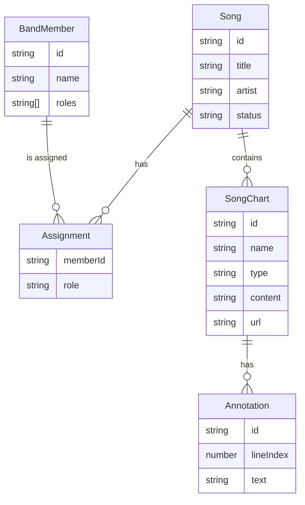

*Sources: [types.ts:10-89]()*

## Feature Components

The application is broken down into several feature-specific components that handle distinct areas of functionality.

### SongDetail View

The `SongDetail` component is a complex view responsible for displaying all information related to a single song. It manages its own internal state, such as the active tab (`OVERVIEW`, `CHARTS`) and the currently selected chart (`activeChartId`).

Key features within `SongDetail`:
- **Multi-Chart Display**: It can render different chart types, including text charts using `SmartTabEditor` and Guitar Pro files using `AlphaTabRenderer`.
- **File Uploads**: Handles uploading new charts (`.pdf`, images, `.gp*`) and backing tracks. Uploaded files are converted to Base64 data URIs for storage within the song object.
- **AI Integration**: Provides an interface to interact with the "Studio Assistant" (Gemini AI) for music analysis, using the `getMusicAnalysis` service.
- **Metadata Editing**: Allows for inline editing of song metadata like title, artist, BPM, and key.

*Sources: [components/SongDetail.tsx:32-34, 43-55, 107-123, 172-194]()*

### SmartTabEditor

This component is a specialized editor for text-based song charts (lyrics and chords). It provides both a read-only "VIEW" mode and an "EDIT" mode.

Key functionalities:
- **Line Analysis**: Automatically detects and styles lines as `CHORD`, `LYRIC`, `HEADER`, or `TAB` based on regex patterns and heuristics.
- **Chord Transposition**: Can transpose chord lines up or down by a given number of semitones. This logic is implemented in the `transposeChord` and `transposeLine` functions.
- **Annotations**: Allows users to add, view, and delete annotations on specific lines of the chart.

The following diagram illustrates the process of a user transposing a chord chart.

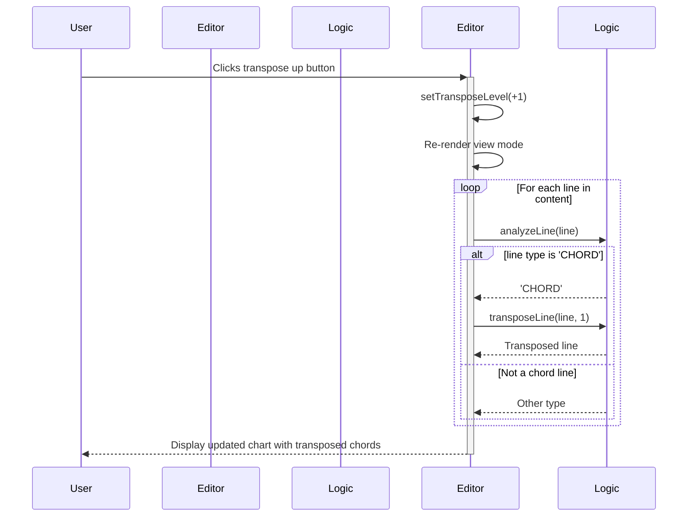

*Sources: [components/SmartTabEditor.tsx:103-125, 131-155]()*

## External Services

### Google Gemini AI Integration

The application leverages Google's Gemini AI through the `geminiService.ts` module. This service acts as a wrapper for the AI SDK, providing structured functions for specific tasks.

| Function | Description | Source |
|---|---|---|
| `getMusicAnalysis` | Sends a generic prompt, song context, and optional media data (e.g., an image of a chart) to the `gemini-2.5-flash` model for analysis. | `services/geminiService.ts:40-62` |
| `extractSongParts` | Sends media data and an instruction to the AI, expecting a structured JSON response containing song parts (e.g., intro, verse, solo). | `services/geminiService.ts:64-96` |
| `extractPracticePlan` | Generates a practice routine for a specific song, requesting a JSON response. | `services/geminiService.ts:28-44` |

The AI service can process multi-modal input, meaning it can analyze both text and media (images, etc.) in a single request. This is achieved by constructing a `parts` array that includes both text and `inlineData` objects.

```typescript
// services/geminiService.ts:70-77
const parts: any[] = [{ text: instruction }];
if (mediaData) {
  parts.push({
    inlineData: {
      mimeType: mediaData.mimeType,
      data: mediaData.data
    }
  });
}
```

*Sources: [services/geminiService.ts:70-77](), [components/SongDetail.tsx:107-123]()*

## Summary

The Band Assist application employs a robust, client-centric architecture. It uses React for its component-based UI, manages state centrally in its top-level `App` component, and uses a `ViewState` system for navigation. Data persistence is handled simply and effectively via browser `localStorage`, making the application portable and server-independent for its core features. The integration of external services like Google Gemini for AI-driven analysis and AlphaTab for rendering Guitar Pro files demonstrates a modern approach to enhancing user functionality within a SPA.

---

<a id='page-3'></a>

## State Management & Data Persistence

### Related Pages

Related topics: [Application Architecture](#page-2), [Core Data Models](#page-5)

<details>
<summary>Relevant source files</summary>
The following files were used as context for generating this wiki page:

- [App.tsx](https://github.com/zazu-22/band_assist/blob/main/App.tsx)
- [types.ts](https://github.com/zazu-22/band_assist/blob/main/types.ts)
- [components/Settings.tsx](https://github.com/zazu-22/band_assist/blob/main/components/Settings.tsx)
- [components/SongDetail.tsx](https://github.com/zazu-22/band_assist/blob/main/components/SongDetail.tsx)
- [services/storageService.ts](https://github.com/zazu-22/band_assist/blob/main/services/storageService.ts)

</details>

# State Management & Data Persistence

The application employs a centralized state management strategy within the root `App` component, leveraging React's built-in `useState` and `useEffect` hooks. This approach provides a single source of truth for core application data, which is then passed down to child components via props.

Data persistence is handled by a dedicated `StorageService` that abstracts interactions with the browser's `localStorage`. This service is responsible for loading data on application startup, saving data automatically upon any state change, and handling manual data import/export operations. This ensures that the user's data is preserved across sessions.

## Core State Architecture

The primary state of the application is initialized and managed within the `App.tsx` component. This component acts as the container for all major data entities, including songs, band members, roles, and events.

Sources: [App.tsx:16-56]()

### State Initialization

On initial load, the application attempts to hydrate its state from `localStorage` using a lazy initialization pattern within the `useState` hooks. If no data is found in storage, it falls back to a set of initial default data.

```typescript
// File: App.tsx:18-21
const [songs, setSongs] = useState<Song[]>(() => {
   const data = StorageService.load();
   return data.songs || INITIAL_SONGS;
});
```

The main state variables are summarized below:

| State Variable | Type | Description | Source File |
| :--- | :--- | :--- | :--- |
| `songs` | `Song[]` | An array of all songs in the band's repertoire. | [App.tsx:18]() |
| `members` | `BandMember[]` | An array of all band members. | [App.tsx:24]() |
| `availableRoles` | `string[]` | A list of all possible instrument/vocal roles. | [App.tsx:32]() |
| `events` | `BandEvent[]` | An array of scheduled events like practices or gigs. | [App.tsx:39]() |

### Data Flow Diagram

The following diagram illustrates the top-down data flow from the central `App` component to various child components. State is passed down as props, and update functions are provided for children to notify the parent of changes.

```mermaid
graph TD
    subgraph App.tsx
        A[useState: songs, members, etc.]
    end

    A -->|props: songs| B(Dashboard)
    A -->|props: song, members, onUpdateSong| C(SongDetail)
    A -->|props: members, setMembers| D(Settings)
    A -->|props: events| E(ScheduleManager)
    A -->|props: songs| F(SetlistManager)

    C -->>|onUpdateSong(updatedSong)| A
    D -->>|setMembers(newMembers)| A
```

*This diagram shows how the central state in `App.tsx` is distributed to child components.*
Sources: [App.tsx:88-120]()

## Data Models

The core data structures for the application are defined in `types.ts`. These interfaces ensure type safety and provide a clear schema for all major entities.

Sources: [types.ts]()

### Entity Relationship Diagram

The relationships between the main data models are depicted below. A `Song` contains `Assignments` that link to a `BandMember`, and it also has multiple `SongChart` objects.

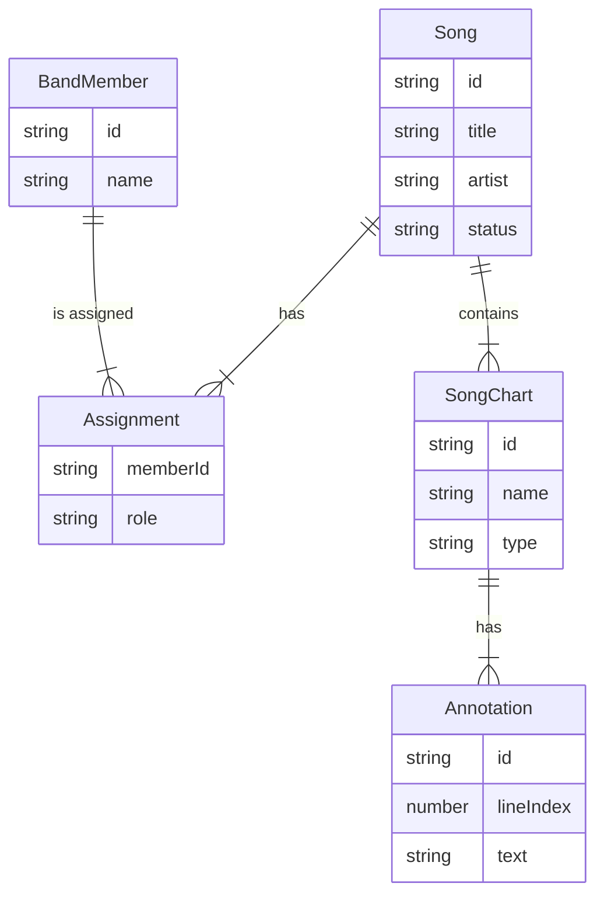

*This diagram shows the primary relationships between `Song`, `BandMember`, `Assignment`, and `SongChart` entities.*
Sources: [types.ts:13-64]()

### The `Song` Interface

The `Song` interface is the most complex data model, central to the application's functionality. It includes metadata, assignments, and a flexible multi-chart system.

| Field | Type | Description |
| :--- | :--- | :--- |
| `id` | `string` | Unique identifier for the song. |
| `title` | `string` | The title of the song. |
| `artist` | `string` | The original artist of the song. |
| `status` | `'To Learn' \| 'In Progress' \| 'Performance Ready'` | The current learning status of the song. |
| `assignments` | `Assignment[]` | An array linking band members to specific roles for this song. |
| `charts` | `SongChart[]` | An array of charts (e.g., tabs, lead sheets) for the song. |
| `backingTrackUrl` | `string` (optional) | A data URI for an associated audio backing track. |
| `targetDate` | `string` (optional) | A YYYY-MM-DD target date for completion. |

Sources: [types.ts:51-72]()

## Data Persistence Layer

The `StorageService` is a crucial module that handles all interactions with the browser's `localStorage`, providing a simple API for saving, loading, and managing application data. Although the source file for `storageService.ts` is not provided, its public methods are consistently used throughout the application.

### Persistence Operations

The service provides methods for the complete data lifecycle:

| Method | Description | Used In |
| :--- | :--- | :--- |
| `save()` | Saves the current state (songs, members, roles, events) to `localStorage`. | [App.tsx:59]() |
| `load()` | Loads the entire application state from `localStorage`. | [App.tsx:19](), [App.tsx:25]() |
| `exportData()` | Serializes the current application state into a JSON file for download. | [components/Settings.tsx:135]() |
| `importData()` | Reads a JSON file and overwrites the current application state. | [components/Settings.tsx:145]() |

### Application Load Sequence

When the application starts, it immediately attempts to load any previously saved data.

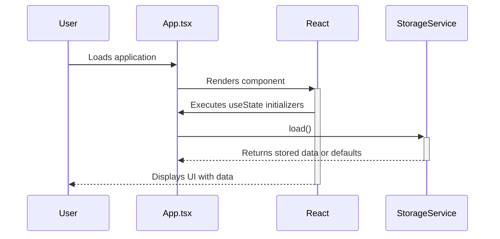

*This sequence shows how data is loaded from `StorageService` during the initial render of the `App` component.*
Sources: [App.tsx:18-42]()

### Auto-Save Mechanism

To ensure data is never lost, the application automatically saves the entire state to `localStorage` whenever any of the core data arrays (`songs`, `members`, etc.) are modified. This is achieved with a `useEffect` hook in `App.tsx`.

```typescript
// File: App.tsx:57-59
useEffect(() => {
    StorageService.save(songs, members, availableRoles, events);
}, [songs, members, availableRoles, events]);
```

The auto-save flow is triggered by any state update.

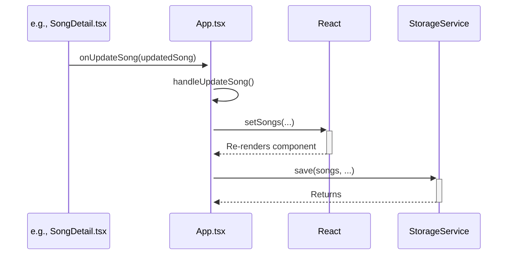

*This sequence demonstrates how a state update in a child component triggers the auto-save `useEffect` hook in `App.tsx`.*
Sources: [App.tsx:57-59](), [App.tsx:83-85](), [components/SongDetail.tsx:103-106]()

## State Propagation and Updates

State is passed from the `App` component down to its children using props. To allow children to modify the state, callback functions are passed down as well. This pattern is often referred to as "lifting state up".

### Update Pattern Example

The `handleUpdateSong` function in `App.tsx` is a clear example of this pattern. It is passed as the `onUpdateSong` prop to `SongDetail`.

1. **`App.tsx` defines the update logic and passes it down:**

    ```typescript
    // File: App.tsx:83-85
    const handleUpdateSong = (updatedSong: Song) => {
      setSongs(songs.map(s => s.id === updatedSong.id ? updatedSong : s));
    };

    // File: App.tsx:96
    <SongDetail 
      ...
      onUpdateSong={handleUpdateSong}
    />
    ```

2. **`SongDetail.tsx` receives the function and calls it when needed:**

    ```typescript
    // File: components/SongDetail.tsx:103-106
    const handleAddRole = (memberId: string, role: string) => {
      const newAssignments = [...song.assignments, { memberId, role }];
      onUpdateSong({ ...song, assignments: newAssignments });
    };
    ```

This ensures that all state modifications are centralized in `App.tsx`, maintaining a predictable and unidirectional data flow.

## Summary

The application's state management is centralized in `App.tsx`, providing a single source of truth. Data persistence is robustly handled by a `StorageService` that leverages `localStorage` for automatic session restoration and saving. State is propagated to child components via props, and updates are managed through callback functions, ensuring a unidirectional and maintainable data flow throughout the application.

---

<a id='page-4'></a>

## AI Integration (Gemini Service)

### Related Pages

Related topics: [Application Architecture](#page-2), [Key Components: SongDetail & SmartTabEditor](#page-6)

<details>
<summary>Relevant source files</summary>
The following files were used as context for generating this wiki page:

- [services/geminiService.ts](https://github.com/zazu-22/band_assist/blob/main/services/geminiService.ts)
- [components/SongDetail.tsx](https://github.com/zazu-22/band_assist/blob/main/components/SongDetail.tsx)
- [components/SetlistManager.tsx](https://github.com/zazu-22/band_assist/blob/main/components/SetlistManager.tsx)
- [types.ts](https://github.com/zazu-22/band_assist/blob/main/types.ts)
- [index.html](https://github.com/zazu-22/band_assist/blob/main/index.html)
- [components/SmartTabEditor.tsx](https://github.com/zazu-22/band_assist/blob/main/components/SmartTabEditor.tsx)

</details>

# AI Integration (Gemini Service)

The AI integration provides intelligent features within the Band Assist application by leveraging Google's Gemini models. This system is designed to act as a "Studio Assistant," offering capabilities such as analyzing musical charts, providing coaching advice, suggesting song ideas, and generating structured data like song parts or practice plans.

The core of this integration is the `geminiService`, which acts as a centralized module for all interactions with the Gemini API. Various UI components, primarily `SongDetail` and `SetlistManager`, consume this service to deliver AI-powered functionality directly to the user. The system is designed to handle both text-based prompts and multimodal inputs, such as images or PDFs of musical charts.

Sources: [services/geminiService.ts](), [components/SongDetail.tsx:254-260](), [components/SetlistManager.tsx:64-67]()

## Service Architecture

The AI service architecture is centered around the `geminiService.ts` module. This service handles the initialization of the Gemini client and exposes several functions for different AI tasks.

### Initialization

The service initializes a `GoogleGenAI` client instance using an API key sourced from environment variables (`process.env.API_KEY`). If the API key is not present, the `ai` constant is `null`, and any function calls will return a warning or error message, allowing the application to degrade gracefully without crashing. The dependency on the `@google/genai` library is declared in the main `index.html` file via an import map.

Sources: [services/geminiService.ts:4-6](), [services/geminiService.ts:9-12](), [index.html:26]()

### Core Functions

The `geminiService` exposes a set of asynchronous functions to interact with the Gemini API. The primary model used for these interactions is `gemini-2.5-flash`.

| Function | Description | Key Parameters |
| :--- | :--- | :--- |
| `getMusicAnalysis` | Provides general-purpose music analysis and coaching based on a prompt, context, and optional media data. | `prompt`, `context`, `mediaData` |
| `extractPracticePlan` | Generates a structured 3-step practice routine for a given song. | `songTitle`, `difficulty` |
| `extractSongParts` | Analyzes a musical chart (text or media) and extracts its distinct parts (e.g., Intro, Verse) into a structured JSON array. | `instruction`, `mediaData` |

Sources: [services/geminiService.ts:8-85]()

## AI Features and Implementation

The AI capabilities are integrated into several key areas of the application's user interface.

### Studio Assistant Chat

The `SongDetail` component features a "Studio Assistant" sidebar, which provides a chat-like interface for users to interact with the AI.

#### Data Flow

The user can ask questions about the currently selected song, such as requesting advice on guitar tone, gear, or musical theory. The `handleAskAI` function orchestrates this interaction by gathering context, making the API call, and displaying the response.

The following diagram illustrates the sequence of events when a user interacts with the Studio Assistant.

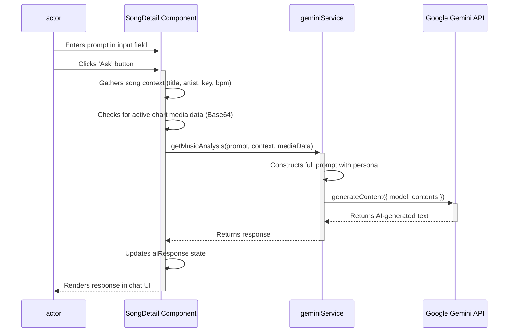

*This diagram shows the end-to-end flow from user input in the `SongDetail` view to receiving and displaying a response from the Gemini API.*
Sources: [components/SongDetail.tsx:112-132](), [services/geminiService.ts:8-45]()

#### Prompt Engineering

The `getMusicAnalysis` function employs specific prompt engineering to guide the AI's responses. It wraps the user's question with a system persona and additional context.

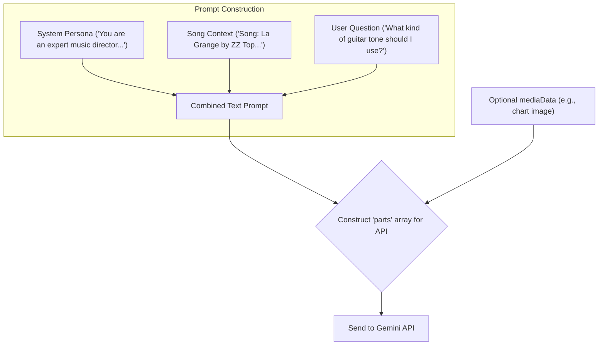

*This flowchart details how the final prompt sent to the Gemini API is constructed from multiple sources.*
Sources: [services/geminiService.ts:16-24]()

#### Multimodal Analysis

The assistant can analyze uploaded charts (PDF, images, or Guitar Pro files). When a user asks a question while a chart is active, the `SongDetail` component reads the chart's `url` (a Base64 data URI), extracts the MIME type and data, and passes it to `getMusicAnalysis` as `mediaData`. This allows the AI to "see" the chart and answer questions about its content.

```typescript
// components/SongDetail.tsx:118-124
    let mediaData = undefined;
    if (activeChart && activeChart.url) {
      const matches = active-chart.url.match(/^data:(.+);base64,(.+)$/);
      if (matches && matches.length === 3) {
        mediaData = { mimeType: matches[1], data: matches[2] };
      }
    }
```

Sources: [components/SongDetail.tsx:118-124](), [services/geminiService.ts:28-35](), [types.ts:40-47]()

### Structured Data Extraction

The `extractSongParts` function is a specialized utility designed to parse a musical chart and return a structured JSON object. This is used for features like automatically breaking down a tab into its constituent parts (Intro, Verse, Chorus, Solo).

This function leverages Gemini's JSON mode by providing a `responseSchema`. This forces the model to return data in a predictable format, which can be directly used by the application.

#### JSON Response Schema

The `responseSchema` for `extractSongParts` is defined as follows:

| Field | Type | Description | Required |
| :--- | :--- | :--- | :--- |
| `name` | String | Name of the part (e.g., Intro, Solo 1) | Yes |
| `instrument` | String | The instrument this part is for | Yes |
| `content` | String | The tablature or musical notes | Yes |
| `difficulty` | String | Brief difficulty rating or note | No |

This structure corresponds to the fields needed to create `SongPart` objects within the application.

Sources: [services/geminiService.ts:91-103](), [types.ts:25-31]()

### Setlist Suggestions

The AI is also used in the `SetlistManager` to provide creative input. The `askAiForSuggestions` function generates a prompt based on the current list of songs and asks the AI to suggest three more thematically appropriate songs. This demonstrates a creative use case for the AI beyond simple analysis.

```typescript
// components/SetlistManager.tsx:65-67
  const askAiForSuggestions = async () => {
    setLoadingSuggestion(true);
    const prompt = `Suggest 3 ZZ Top songs that would fit well in a setlist that already has: ${songs.map(s => s.title).join(', ')}. Just list the titles.`;
    const suggestion = await getMusicAnalysis(prompt);
    // ...
  };
```

Sources: [components/SetlistManager.tsx:64-70]()

## Conclusion

The Gemini AI integration is a cornerstone feature of the Band Assist application, providing a layer of intelligence that enhances user workflow. By centralizing API interactions within `geminiService.ts`, the system maintains a clean separation of concerns. It supports a range of functionalities from conversational chat and multimodal analysis in the `SongDetail` component to creative suggestions in the `SetlistManager`. The use of specific features like JSON-mode output for structured data extraction demonstrates a sophisticated application of the AI's capabilities to meet the specific needs of musicians.

---

<a id='page-5'></a>

## Core Data Models

### Related Pages

Related topics: [State Management & Data Persistence](#page-3), [Key Components: SongDetail & SmartTabEditor](#page-6)

<details>
<summary>Relevant source files</summary>
The following files were used as context for generating this wiki page:

- [types.ts](https://github.com/zazu-22/band_assist/blob/main/types.ts)
- [App.tsx](https://github.com/zazu-22/band_assist/blob/main/App.tsx)
- [components/SongDetail.tsx](https://github.com/zazu-22/band_assist/blob/main/components/SongDetail.tsx)
- [components/Settings.tsx](https://github.com/zazu-22/band_assist/blob/main/components/Settings.tsx)
- [components/SetlistManager.tsx](https://github.com/zazu-22/band_assist/blob/main/components/SetlistManager.tsx)
- [components/BandDashboard.tsx](https://github.com/zazu-22/band_assist/blob/main/components/BandDashboard.tsx)
- [components/SmartTabEditor.tsx](https://github.com/zazu-22/band_assist/blob/main/components/SmartTabEditor.tsx)

</details>

# Core Data Models

The core data models are the structural foundation of the Band Assist application, defining the shape of all major entities such as songs, band members, charts, and events. These models are primarily defined as TypeScript interfaces in `types.ts`, ensuring type safety and predictable state management throughout the React component hierarchy. The application's state, including songs and members, is initialized in `App.tsx` by loading from `StorageService` or falling back to initial default data.

The central entity is the `Song` model, which contains not only metadata like title and artist but also a flexible multi-chart system (`SongChart[]`) and member assignments (`Assignment[]`). This structure allows for detailed and instrument-specific management of a band's repertoire. Other key models include `BandMember` for managing the roster and `BandEvent` for scheduling practices and gigs.

## Data Model Relationships

The following diagram illustrates the primary relationships between the core data entities in the system.

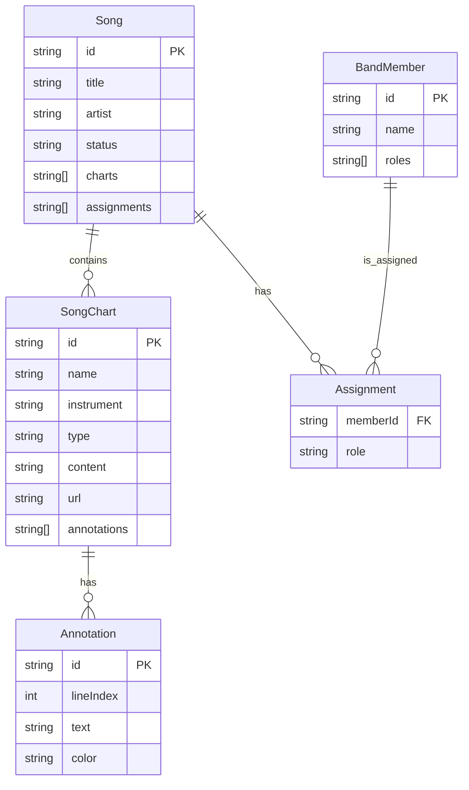

This diagram shows that a `Song` can contain multiple `SongChart` and `Assignment` records. Each `Assignment` links a `Song` to a specific `BandMember`. Similarly, a `SongChart` can have multiple `Annotation` entities associated with it.

Sources: [types.ts:10-85]()

## Song

The `Song` interface is the most complex and central data model in the application. It encapsulates all information related to a single musical piece, from basic metadata to detailed charts and member roles. New songs can be created with default values from the `SetlistManager` component.

Sources: [components/SetlistManager.tsx:43-57]()

```typescript
// types.ts:50-73
export interface Song {
  id: string;
  title: string;
  artist: string;
  duration: string; 
  bpm: number;
  key: string;
  isOriginal: boolean;
  status: 'To Learn' | 'In Progress' | 'Performance Ready';
  assignments: Assignment[];
  parts: SongPart[]; 
  
  // Deprecated in favor of charts array, but kept for migration
  annotations?: Annotation[];
  lyrics?: string;
  tabContent?: string; 
  tabUrl?: string; 
  
  // New Multi-Chart System
  charts: SongChart[];

  backingTrackUrl?: string;
  aiAnalysis?: string;
  targetDate?: string; // YYYY-MM-DD target for completion
}
```

Sources: [types.ts:50-73]()

### Song Properties

| Field | Type | Description |
|---|---|---|
| `id` | `string` | Unique identifier, typically generated via `Date.now().toString()`. |
| `title` | `string` | The title of the song. |
| `artist` | `string` | The artist who performs the song. |
| `duration` | `string` | Song length, formatted as "M:SS". |
| `bpm` | `number` | Beats per minute. |
| `key` | `string` | The musical key of the song (e.g., "E", "Am"). |
| `status` | `'To Learn' \| 'In Progress' \| 'Performance Ready'` | The current learning status of the song for the band. |
| `assignments` | `Assignment[]` | An array linking band members to specific roles for this song. |
| `parts` | `SongPart[]` | An array defining specific sections of the song (e.g., Intro, Solo). |
| `charts` | `SongChart[]` | The primary array holding all musical charts (tabs, sheets, etc.) for the song. |
| `backingTrackUrl` | `string` (optional) | A Base64 Data URI for an audio backing track. |
| `targetDate` | `string` (optional) | A YYYY-MM-DD formatted date for completion goal. |

Sources: [types.ts:50-73](), [components/SongDetail.tsx:75-83]()

### `SongChart`

The `SongChart` model is a flexible structure designed to hold various types of musical notation or charts for a specific instrument. This is a key part of the "Multi-Chart System".

```typescript
// types.ts:39-48
export interface SongChart {
  id: string;
  name: string; // e.g. "Bass Tab", "Lead Sheet"
  instrument: string; // For filtering
  type: 'TEXT' | 'IMAGE' | 'PDF' | 'GP'; // Added GP for Guitar Pro files
  content?: string; // For text tabs
  url?: string; // For PDF/Images/GP (Base64 Data URI)
  annotations?: Annotation[];
}
```

Sources: [types.ts:39-48]()

| Field | Type | Description |
|---|---|---|
| `id` | `string` | Unique identifier for the chart. |
| `name` | `string` | A descriptive name for the chart (e.g., "Verse Chords"). |
| `instrument` | `string` | The instrument this chart is for (e.g., "Lead Guitar"). |
| `type` | `'TEXT' \| 'IMAGE' \| 'PDF' \| 'GP'` | The format of the chart. `GP` is for Guitar Pro files. |
| `content` | `string` (optional) | Used for `'TEXT'` type charts, holds the raw text/tablature. |
| `url` | `string` (optional) | A Base64 Data URI used for `IMAGE`, `PDF`, and `GP` types. |
| `annotations` | `Annotation[]` (optional) | An array of annotations specific to this chart. |

The `SongDetail` component handles the logic for creating and uploading different chart types, including file type detection for PDF, images, and Guitar Pro files.

Sources: [types.ts:39-48](), [components/SongDetail.tsx:162-172]()

### `Annotation`

Annotations are notes attached to specific lines within a `'TEXT'` type `SongChart`. They are managed within the `SmartTabEditor` component.

```typescript
// types.ts:32-37
export interface Annotation {
  id: string;
  lineIndex: number;
  text: string;
  color: 'yellow' | 'red' | 'blue' | 'green';
}
```

Sources: [types.ts:32-37]()

| Field | Type | Description |
|---|---|---|
| `id` | `string` | Unique identifier for the annotation. |
| `lineIndex` | `number` | The zero-based line number in the text content where the note is attached. |
| `text` | `string` | The content of the note. |
| `color` | `'yellow' \| 'red' \| 'blue' \| 'green'` | The visual color of the annotation. |

The logic for adding and deleting annotations operates on the `annotations` array within a `SongChart` object.

Sources: [components/SmartTabEditor.tsx:135-147](), [types.ts:32-37]()

### `Assignment`

This simple interface creates a link between a `BandMember` and a `role` for a specific `Song`.

```typescript
// types.ts:16-19
export interface Assignment {
  memberId: string; // Reference to BandMember.id
  role: string; // Specific role for this song (e.g. "Lead Guitar")
}
```

Sources: [types.ts:16-19]()

This data is used in components like `BandDashboard` to filter and display songs relevant to a selected member.

Sources: [components/BandDashboard.tsx:21-26]()

## `BandMember`

The `BandMember` model represents a person in the band. The application's roster of members is managed in the `Settings` view.

```typescript
// types.ts:8-13
export interface BandMember {
  id: string;
  name: string;
  roles: string[]; // Default/Preferred roles (e.g. ["Lead Guitar", "Vocals"])
  avatarColor?: string;
}
```

Sources: [types.ts:8-13]()

| Field | Type | Description |
|---|---|---|
| `id` | `string` | Unique identifier, generated via `Date.now().toString()`. |
| `name` | `string` | The member's name. |
| `roles` | `string[]` | A list of default instruments or roles the member can perform. |
| `avatarColor` | `string` (optional) | A Tailwind CSS class for the member's avatar background color. |

New members are created with an empty `roles` array and assigned a default avatar color based on the number of existing members.

Sources: [components/Settings.tsx:47-55]()

## `BandEvent`

This model is used for scheduling practices, gigs, or other band-related events.

```typescript
// types.ts:75-83
export interface BandEvent {
  id: string;
  title: string;
  date: string; // YYYY-MM-DD
  time?: string; // HH:MM
  type: 'PRACTICE' | 'GIG' | 'OTHER';
  location?: string;
  notes?: string;
}
```

Sources: [types.ts:75-83]()

| Field | Type | Description |
|---|---|---|
| `id` | `string` | Unique identifier for the event. |
| `title` | `string` | The name of the event (e.g., "Weekly Practice"). |
| `date` | `string` | The date of the event in `YYYY-MM-DD` format. |
| `time` | `string` (optional) | The time of the event in `HH:MM` format. |
| `type` | `'PRACTICE' \| 'GIG' \| 'OTHER'` | The category of the event. |
| `location` | `string` (optional) | The physical location of the event. |
| `notes` | `string` (optional) | Additional details about the event. |

The initial state in `App.tsx` includes a default placeholder event if none are loaded from storage.

Sources: [App.tsx:46-51]()

## Conclusion

The application's data architecture is centered around a set of clearly defined TypeScript interfaces. The `Song` model, with its nested `SongChart` and `Assignment` arrays, provides a robust and extensible system for managing a band's entire songbook. The separation of concerns into distinct models like `BandMember` and `BandEvent` allows different parts of the application, from the settings page to the band dashboard, to operate on a consistent and predictable state structure. This typed, model-driven approach is fundamental to the application's functionality and maintainability.

---

<a id='page-6'></a>

## Key Components: SongDetail & SmartTabEditor

### Related Pages

Related topics: [Application Architecture](#page-2), [AI Integration (Gemini Service)](#page-4), [Core Data Models](#page-5)

<details>
<summary>Relevant source files</summary>
The following files were used as context for generating this wiki page:

- [components/SongDetail.tsx](https://github.com/zazu-22/band_assist/blob/main/components/SongDetail.tsx)
- [components/SmartTabEditor.tsx](https://github.com/zazu-22/band_assist/blob/main/components/SmartTabEditor.tsx)
- [types.ts](https://github.com/zazu-22/band_assist/blob/main/types.ts)
- [components/PracticeRoom.tsx](https://github.com/zazu-22/band_assist/blob/main/components/PracticeRoom.tsx)
- [components/PerformanceMode.tsx](https://github.com/zazu-22/band_assist/blob/main/components/PerformanceMode.tsx)
- [services/geminiService.ts](https://github.com/zazu-22/band_assist/blob/main/services/geminiService.ts)

</details>

# Key Components: SongDetail & SmartTabEditor

## Introduction

The `SongDetail` and `SmartTabEditor` components form the core of the song management and viewing experience within the Band Assist application. `SongDetail` serves as a comprehensive dashboard for a single song, providing access to its metadata, associated musical charts, member assignments, and an integrated AI assistant. It acts as a container and state manager for various song-related data.

The `SmartTabEditor` is a specialized, reusable component designed for displaying and interacting with text-based musical charts (e.g., chords over lyrics, tablature). It is utilized within `SongDetail` as well as other modules like the [Practice Room](#) and [Performance Mode](#) to provide intelligent features such as syntax highlighting, chord transposition, and line-based annotations. Together, these components deliver a rich, interactive interface for musicians to learn, practice, and manage their repertoire.

## `SongDetail` Component

The `SongDetail` component is the primary interface for managing all aspects of a specific song. It is responsible for rendering song data, handling user interactions for updates, and orchestrating child components and services.

Sources: [components/SongDetail.tsx]()

### State Management

The component manages a significant amount of local state to control the UI and handle data modifications before passing them up to the parent `App` component via the `onUpdateSong` callback.

| State Variable        | Type                          | Description                                                                 |
| --------------------- | ----------------------------- | --------------------------------------------------------------------------- |
| `activeTab`           | `'OVERVIEW' \| 'CHARTS' \| ...` | Controls which main tab (Overview, Charts, etc.) is currently visible.      |
| `activeChartId`       | `string \| null`              | Stores the ID of the currently selected `SongChart` for display.            |
| `isEditingMetadata`   | `boolean`                     | Toggles the UI between viewing and editing the song's metadata.             |
| `editForm`            | `object`                      | Holds the state of song metadata fields during an edit session.             |
| `isAddingChart`       | `boolean`                     | Controls the visibility of the modal for creating a new chart.              |
| `aiChat`              | `string`                      | Holds the user's input for the AI assistant.                                |
| `aiResponse`          | `string`                      | Stores the response received from the AI assistant.                         |
| `loadingAi`           | `boolean`                     | Indicates when an AI request is in progress.                                |

Sources: [components/SongDetail.tsx:40-66]()

### Core Features

#### Chart Management

`SongDetail` provides robust functionality for managing multiple musical charts associated with a song. Users can create new text charts, upload various file types, and switch between them.

The chart upload process is handled by the `handleUploadChart` function, which reads a local file and converts it into a `SongChart` object with a Base64 data URI.

```mermaid
graph TD
    A[User clicks "Upload Chart"] --> B{File Input Triggered};
    B --> C[User selects a file];
    C --> D{handleUploadChart(e)};
    D --> E{File size check > 10MB?};
    E -- Yes --> F[Alert user "File too large"];
    E -- No --> G[Create FileReader];
    G --> H{Determine chart type};
    H -- .pdf --> I[type: 'PDF'];
    H -- image/* --> J[type: 'IMAGE'];
    H -- .gp* --> K[type: 'GP'];
    I --> L{reader.onload};
    J --> L;
    K --> L;
    L --> M[Create new SongChart object];
    M --> N[Set url to Base64 data URI];
    N --> O[onUpdateSong({...song, charts: updatedCharts})];
    O --> P[Update application state];
```

*A diagram illustrating the chart upload flow.*
Sources: [components/SongDetail.tsx:210-244]()

#### AI Studio Assistant

A key feature is the integration with an AI model via `geminiService` to provide musical analysis and suggestions. The `handleAskAI` function constructs a detailed context and sends it along with the user's prompt.

The interaction flow is as follows:

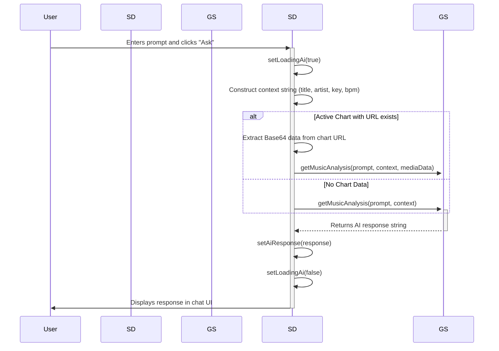

*Sequence diagram for an AI Assistant request.*
Sources: [components/SongDetail.tsx:112-132]()

## `SmartTabEditor` Component

This component is a specialized viewer and editor for text-based song charts. It is used in `SongDetail`, `PracticeRoom`, and `PerformanceMode` to render content with musical intelligence.

Sources: [components/SmartTabEditor.tsx](), [components/PracticeRoom.tsx:111-116](), [components/PerformanceMode.tsx:121-126]()

### Data Models & Relationships

The `Song`, `SongChart`, and `Annotation` types define the structure of the data managed by `SongDetail` and rendered by `SmartTabEditor`.

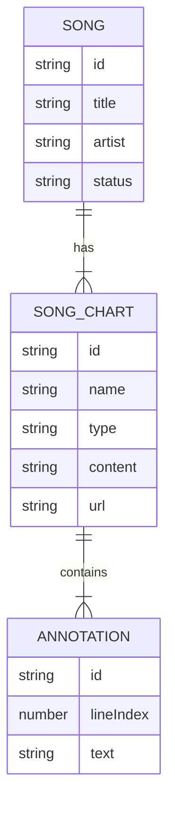

*Entity-Relationship diagram for core song data structures.*
Sources: [types.ts:29-67]()

The key data structures are defined in `types.ts`:

**`SongChart` Interface**

| Property | Type | Description |
|---|---|---|
| `id` | `string` | Unique identifier for the chart. |
| `name` | `string` | Display name (e.g., "Bass Tab"). |
| `instrument` | `string` | The primary instrument for the chart. |
| `type` | `'TEXT' \| 'IMAGE' \| 'PDF' \| 'GP'` | The format of the chart. |
| `content` | `string` (optional) | The raw string content for 'TEXT' type charts. |
| `url` | `string` (optional) | Base64 Data URI for non-text chart types. |
| `annotations` | `Annotation[]` (optional) | A list of annotations for the chart. |
Sources: [types.ts:40-48]()

**`Annotation` Interface**

| Property | Type | Description |
|---|---|---|
| `id` | `string` | Unique identifier for the annotation. |
| `lineIndex` | `number` | The zero-based index of the line this annotation applies to. |
| `text` | `string` | The content of the annotation note. |
| `color` | `'yellow' \| 'red' \| ...` | The display color for the annotation. |
Sources: [types.ts:33-38]()

### Key Features

#### Line Analysis

The `analyzeLine` function is central to the component's "smart" behavior. It parses each line of the chart's content to determine its type, which dictates how it's styled.

| Line Type | Heuristic / Regex |
|-----------|-------------------|
| `EMPTY`   | Line contains only whitespace. |
| `TAB`     | Contains three or more `-` or `\|` characters: `/[-|]{3,}/`. |
| `HEADER`  | Enclosed in square brackets or ends with a colon: `/^\[.*\]$/` or `trimmed.endsWith(':')`. |
| `CHORD`   | More than 50% of whitespace-separated tokens match a valid chord pattern and are not common English words (e.g., 'A', 'I', 'Am'). |
| `LYRIC`   | The default type if no other rules match. |
Sources: [components/SmartTabEditor.tsx:156-193]()

#### Chord Transposition

The editor includes a powerful chord transposition feature. It can shift all detected chords in a chart up or down by a specified number of semitones.

The logic flow for transposing a line of text is as follows:

```mermaid
graph TD
    A[transposeLine(line, amount)] --> B{Is amount === 0?};
    B -- Yes --> C[Return original line];
    B -- No --> D{Find all chord-like patterns in line};
    D -- For each match --> E[transposeChord(match, amount)];
    E --> F{Split match into root & suffix};
    F --> G{Is root in NOTES or NOTES_FLAT?};
    G -- No --> H[Return original match];
    G -- Yes --> I{Calculate new note index};
    I --> J[newIndex = (index + semitones) % 12];
    J --> K{Get new root from NOTES array};
    K --> L[Return newRoot + suffix];
    L --> M{Replace original match in line};
    M --> D;
    D -- After all matches --> N[Return modified line];
```

*A diagram showing the chord transposition logic.*
Sources: [components/SmartTabEditor.tsx:32-54, 143-151]()

This functionality relies on two helper arrays, `NOTES` (using sharps) and `NOTES_FLAT`, to handle enharmonic equivalents. The transposition logic prefers sharps for the output.

Sources: [components/SmartTabEditor.tsx:12-13]()

## Summary

The `SongDetail` component acts as the high-level controller and view for all song-related data, providing functionality for metadata editing, multi-format chart management, and AI-powered analysis. It delegates the rendering of text-based charts to the `SmartTabEditor` component. The `SmartTabEditor`, in turn, provides specialized features like automatic syntax highlighting based on line content analysis and on-the-fly chord transposition. These components, supported by the data structures in `types.ts`, create a flexible and powerful system for managing a band's songbook.

---
